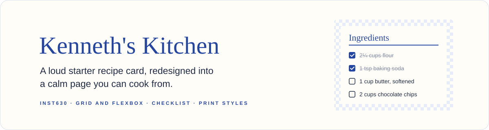
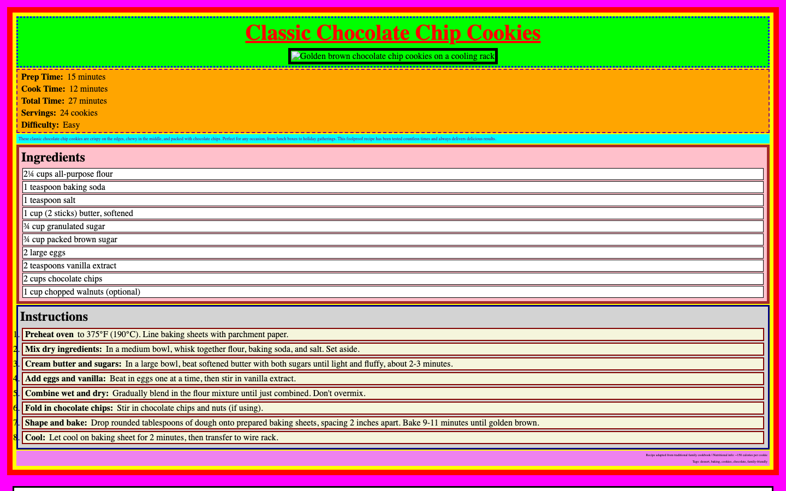
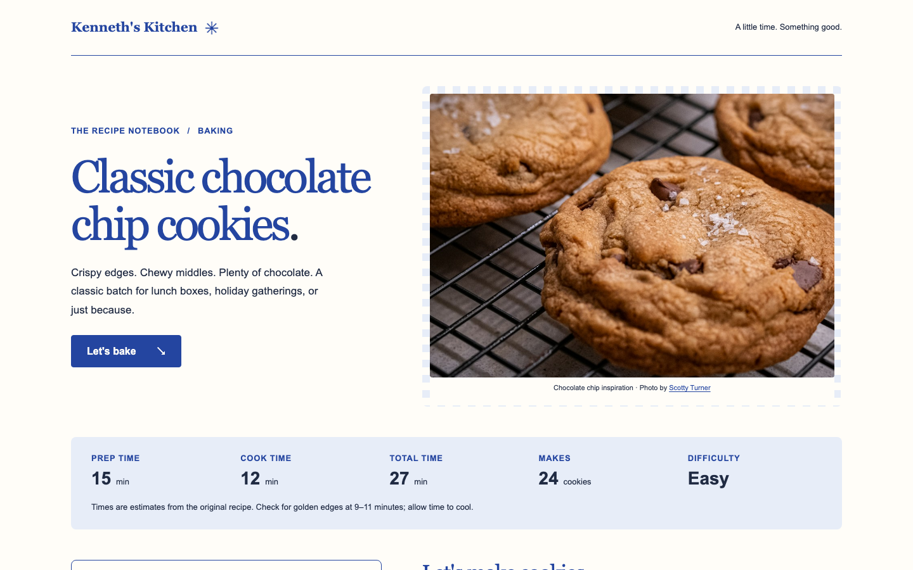
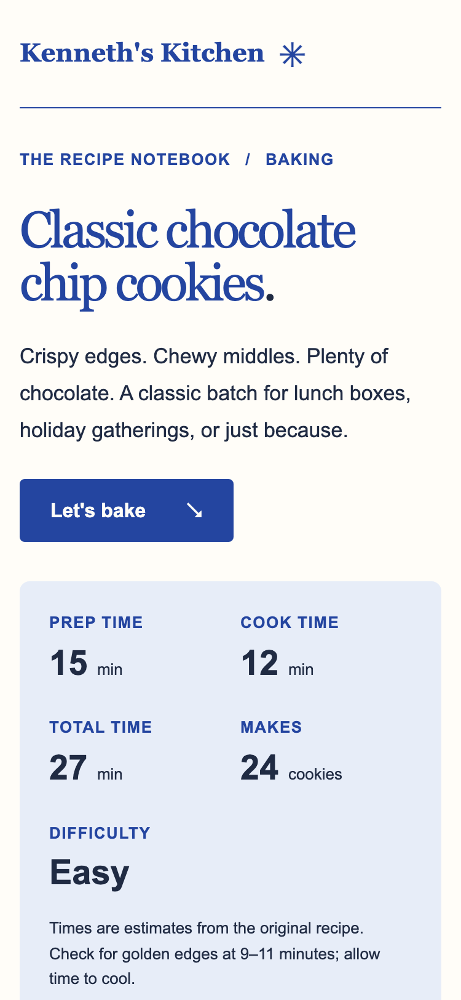
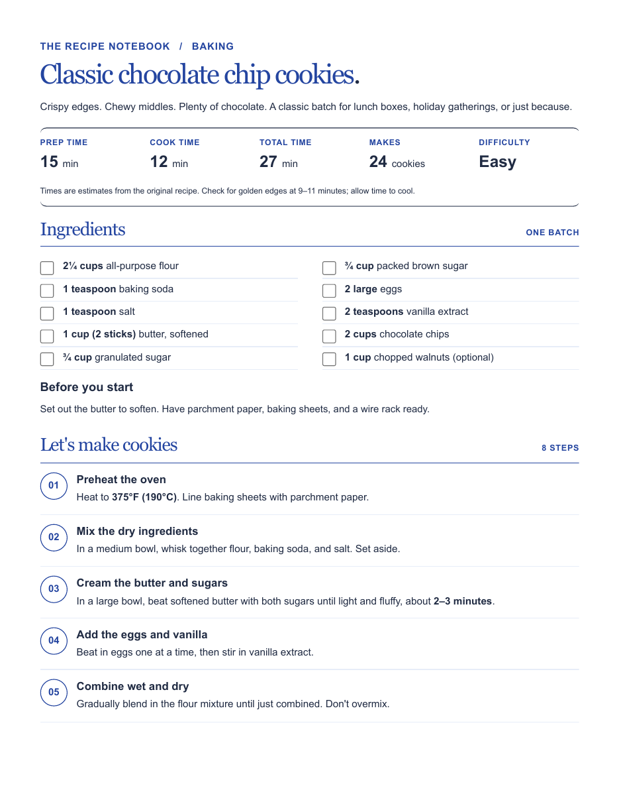

<p align="center">
  
</p>

<p align="center">
  <strong>A redesign of the INST630 chocolate chip cookie recipe card.</strong><br>
  The page puts recipe timing up front, keeps ingredients beside the instructions on larger screens, and stacks the content on phones. Ingredients can be checked off with a mouse, touch, or keyboard.
</p>

<p align="center">
  
  
  <a href="https://kennethyeaher.github.io/uglyPageCute/"></a>
  
</p>

<p align="center">
  <a href="https://kennethyeaher.github.io/uglyPageCute/"><strong>Open the live recipe ↗</strong></a> &nbsp; · &nbsp;
  <a href="#what-to-look-for">What to look for</a> &nbsp; · &nbsp;
  <a href="#design">Design</a> &nbsp; · &nbsp;
  <a href="docs/design-notes.md">Design notes and checks</a> &nbsp; · &nbsp;
  <a href="#sources-and-limits">Sources and limits</a>
</p>

---

<table>
  <tr>
    <th>Before: the supplied course starter</th>
    <th>After: the redesign</th>
  </tr>
  <tr>
    <td width="50%"></td>
    <td width="50%"></td>
  </tr>
</table>

<sub>Both captured at 1440px wide on October 3, 2026. The starter is rendered from the first commit in this repository. Its placeholder photo is requested from via.placeholder.com, which did not load at capture time, so the alt text shows in its place.</sub>

<details>
<summary><strong>See the phone layout and the printed page</strong></summary>
<br>

<table>
  <tr>
    <th>375px phone</th>
    <th>Printed, page 1 of 2</th>
  </tr>
  <tr>
    <td width="40%"></td>
    <td width="60%"></td>
  </tr>
</table>

<sub>The print view is Chromium's PDF output of the live page on US Letter with backgrounds off. Steps six through eight continue on page 2.</sub>

</details>

## My contribution

I redesigned the supplied recipe card with responsive layout, a native ingredient checklist, keyboard navigation, and print styles. The original recipe content and its inconsistencies remain documented below.

## What to look for

The recipe is usable through native browser controls: ingredient checkboxes, a reset button, and in-page navigation. The wide layout keeps ingredients near the method, while the narrow layout follows a single reading order. Printing removes the decorative page elements and keeps the recipe content.

This makes the project a small study in reducing the steps between reading a recipe and using it, without adding a JavaScript application or account system.

## Use the recipe

- Select an ingredient label to check it off. Select it again to undo.
- Use **Clear checks** to start a new batch.
- Use **Let's bake** to jump to the instructions. Keyboard users also get a skip link to the ingredients.
- Print through the browser menu. Print styles remove the photo and navigation while preserving the recipe.

The checklist does not save progress across devices or sessions. A browser may restore form values on reload; **Clear checks** resets them explicitly.

## Design

The five interface colors are ink, blue, paper, pale blue, and butter yellow. Georgia gives the title and section headings a cookbook feel; Arial keeps the instructions and quantities easy to read. A small checkered photo border references a kitchen towel without placing a pattern behind the cooking text.

The page starts with one Grid column. At `48rem`, named areas place the title beside the photo and the ingredients beside the instructions. Flexbox handles the timing facts, ingredient labels, step numbers, and section headings.

See [design notes and checks](docs/design-notes.md) for details.

## Sources and limits

The recipe comes from the supplied `asst_1_recipe` course starter. All ten ingredients and eight cooking steps are retained. The introductory description is shortened, and the unsupported claim that the recipe has been tested countless times is omitted.

The starter lists 12 minutes of cooking time and 27 minutes total, while its baking step says 9–11 minutes. Both are retained with a visible timing note. Nutrition is the starter's estimate, not an independently calculated value. The recipe itself has not been kitchen tested for this project.

The photo is by [Scotty Turner on Unsplash](https://unsplash.com/photos/chocolate-chip-cookies-cooling-on-a-wire-rack-S9Wxl_7adfY), used under the [Unsplash License](https://unsplash.com/license). See [photo credit](assets/README.md). The supplied textbook and personal style guides are reference materials and are not included in this repository.

---

## Run locally

Open `index.html` in a browser. No installation, build step, external font request, or JavaScript is required. The photo and site icon are stored locally.

To preview through a local server with Python 3:

```sh
python3 -m http.server 8000
```

Open `http://localhost:8000`.

## Files

| File | Purpose |
| --- | --- |
| `index.html` | Semantic recipe content and native form controls |
| `style.css` | Design tokens, Grid layout, Flexbox components, responsive and print styles |
| `assets/` | Cookie photograph, site icon, and photo credit |
| `docs/design-notes.md` | Design rationale, rubric coverage, and verification record |
| `docs/reflection.md` | Four sentence submission reflection draft |

<details>
<summary><strong>Publish with GitHub Pages</strong></summary>
<br>

This is a static site. Publish the `main` branch from the repository root in **Settings → Pages → Deploy from a branch**. Keep `index.html`, `style.css`, and `assets/` together so the relative paths resolve under the repository URL.

</details>

---

## Author

**Kenneth Yeaher**  
MS in Human Computer Interaction  
University of Maryland, College Park  
[](https://www.linkedin.com/in/kennethyeaher/)

`HTML and CSS` · `Responsive Design`
